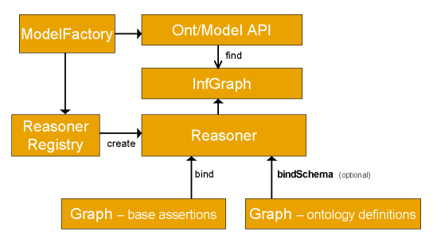

## 推理机制概览



上图所示，最终要完成的目的是构建出`infGraph`，它是被推理机`Reasoner`推理得到的图。其中关系构建和推理部分jena基本帮我们做完了，我们要做的就是提供数据和规则，并将这些数据和规则装填到Model和Reasoner中。

### 我们需要做的事

1. 提供schema : 对应上图的 `Graph - ontology definitions`
2. 提供基于schema的data : 对应上图的 `Graph - base assertions`
3. 提供基于schema的rule

    > 为了方便，本文有时又将 “基于schema的data” 写成 instance, 因为shcema和instance的关系就像类和对象的关系。将 “基于schema的rule” 直接写成 rule。

为了更好地理解，可类比编译原理中的几个概念。schema相当于“词法”，基于schema的rule相当于“文法”，基于schema的data相当于“具体的源代码”。


## 推理案例

### 最简单的推理案例

在`src\main\java\cn\edu\hust\epic\demo\Demo1.java`中给出一个最简单的推理案例，这个推理案例没有用到rule，只是用到了schema和基于schame的data。

```java
// 创建一个命名空间 namespace
String NS = "urn:x-hp-jena:eg/";

// 创建一个模型，jena把一个模型当成一个推理项目
Model rdfsExample = ModelFactory.createDefaultModel();

// 声明该模型中具有 p 和 q 属性
Property p = rdfsExample.createProperty(NS, "p");
Property q = rdfsExample.createProperty(NS, "q");

// 声明 p 是 q 的子属性
rdfsExample.add(p, RDFS.subPropertyOf, q);

// 上面的属性 p 和 q 都只是声明该模型具有这种属性，并没有指定
// 哪一个个体有该属性。下面创建了一个实体资源 a ，并指定它具有
// 属性 p ，并且属性 p 的值是 "foo"
rdfsExample.createResource(NS + "a").addProperty(p, "foo");

// 创建并使用 RDFS 推理模型
InfModel inf = ModelFactory.createRDFSModel(rdfsExample);

// 获取实体资源 a ，并输出其 q 属性
// 由于 q 是 p 的父属性
// 所以 a 的 p 属性的值就是其 q 属性的值
Resource a = inf.getResource(NS + "a");
System.out.println("Statement: " + a.getProperty(q));
```

上面的案例中先创建了一个`Model`。然后在模型添加属性p和q，以及指明p是q的子属性，这都schema的范畴。之后添加的实体资源a及其具有的属性p的值foo都属于instance的范畴。最后创建了一个没有添加任何rule的默认推理模型，并用其进行了基本的推理。


到目前为止，我的理解是**schema和instance之间并没有严格的界线**，这个界线取决于我们处理问题的抽象层度。上述案例中的schema在一定层度上也属于instance。


### 引入规则的推理

上一个案例完全是基于schema和instance的。然而现实的推理通常会引入公理(axiom)或一些规则(rule)，本文统称rule。

在jena中，描述rule的文法如下：

```
Rule        :=   bare-rule .
            or   [ bare-rule ]
            or   [ ruleName : bare-rule ]

bare-rule   :=   term, ... term -> hterm, ... hterm    // forward rule
            or   bhterm <- term, ... term    // backward rule

hterm       :=   term
            or   [ bare-rule ]

term        :=   (node, node, node)           // triple pattern
            or   (node, node, functor)        // extended triple pattern
            or   builtin(node, ... node)      // invoke procedura       primitive

bhterm      :=   (node, node, node)           // triple pattern

functor     :=   functorName(node, ... node)  // structured literal

node        :=   uri-ref                   // e.g. http://foo.com/eg
            or   prefix:localname          // e.g. rdf:type
            or   <uri-ref>          // e.g. <myscheme:myuri>
            or   ?varname                    // variable
            or   'a literal'                 // a plain string literal
            or   'lex'^^typeURI              // a typed literal, xsd:* type names supported
            or   number                      // e.g. 42 or 25.5
```

> 其中`,`可以省略。

官方给出了几个rule的例子。其中一个如下。用于限制变量P代表的属性的取值范围是变量D所表示的集合。

```
[allID: (?C rdf:type owl:Restriction), (?C owl:onProperty ?P),
     (?C owl:allValuesFrom ?D) -> (?C owl:equivalentClass all(?P, ?D)) ]
```

在`src\main\java\cn\edu\hust\epic\demo\Demo2.java`中给出一个带有rule的推理案例。


## 总结

以上介绍可以在jena官网找到更详细的说明。

就像在开头说过的，我们需要做如下三件事：

1. 提供schema : 对应上图的 `Graph - ontology definitions`
2. 提供基于schema的data : 对应上图的 `Graph - base assertions`
3. 提供基于schema的rule

其中schema需要根据我们处理的问题来定，它有点像面向对象编程中的类(class)，或者说结构化数据库中的表头（事实上数据库的表头也叫schema）。

而data是需要我们根据schema去采集的。

最后rule可能需要我们手动来编写规则，这个可能需要费不少时间，而且需要较为可靠的规则，目前jena系统好像只支持确定性的逻辑推理，不支持带置信度的推理。


### 关于存储

事实上三元组（主语，谓词，对象）存储已经基本满足要求。

在jena中，主语和对象都表示为`Resource`，谓词是用`Property`表示。

在可视化中，主语和对象都是节点，而整个三元组则构成两个节点间的边(`Statement`)。